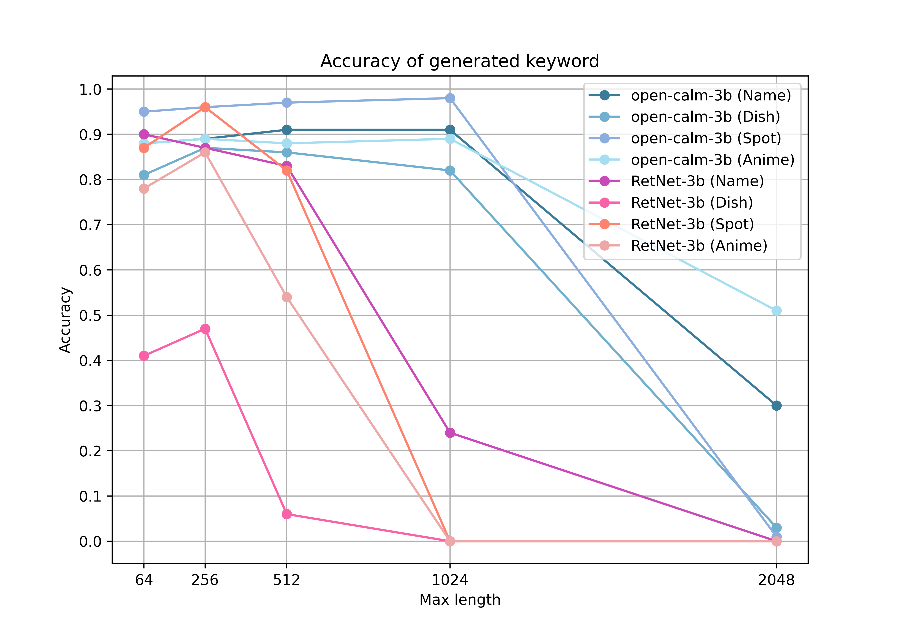

# Evaluation of RetNet's Performance
- According to the paper on RetNet[^1], despite not being a Transformer-based model, RetNet is considered to have high performance. However, sufficient experiments to evaluate their claims have not been conducted.
- Therefore, this article conducts preliminary experiments on the memory capabilities of RetNet.
- For more details on the structure of RetNet, please see [this article](https://zenn.dev/spiralai/articles/a41a934599c7ec).
# About the Passkey Retrieval Task
- As a simple task to evaluate memory performance, there is the Passkey retrieval task. In this task, it is examined whether a set Passkey can be recalled after a text of a certain token length.
- Specifically, the Passkey to be memorized and the input_text to be entered into the language model are set as follows:
    - garbage_text: Text of a certain token length (not containing Passkey)
  ```python
  input_text = f"Passkey is {key}." + garbage_text + "Passkey is"
  ```
- Example:
    - Passkey: 12345
    - garbage_text: The quick brown fox jumps over the lazy dog.
  ```python
    input_text = "Passkey is 12345. The quick brown fox jumps over the lazy dog.\nPasskey is"
  ```
    - If the language model responds with "12345", it is considered correct (memorized).
# Experimental Setup
- Language models
    - RetNet-3b[^2]
    - open-calm-3b[^3] (Transformer based model)
- Passkey retrieval task
    - The prompt for input_text is based on this paper[^4].
    - Types of Passkeys: 100 Passkeys each for Japanese "names," "dishes," "tourist spots," and "anime."
    - Evaluation metric: accuracy (how much can be correctly answered in each category)
    - Total token count of input_text: 64, 256, 512, 1024, 2048
    - Specific input example for "name":
    ```python
    task_description = "Many unnecessary texts hide important information. Please find and remember it. You will be quizzed about this important information later.\n"
    initial_prompt = "My name is xxx." # Key to remember
    information_line = initial_prompt + "Please remember this." + initial_prompt + "\n"
    final_question = "My name is" # Question to elicit the Passkey
    garbage = "The grass is green. The sky is blue. The sun is yellow." # Text unrelated to the Passkey
    
    # Set the input_text as follows and enter it into the model
    input_text = [
      task_description,
      information_line,
      garbage_inf, # Repeat the garbage text until the total token count is reached
      final_question,
    ]
    ``` 

# Experimental Results
The results of the above experimental setup are as follows.

- Each point represents the accuracy of each model and each type of Passkey.
- Horizontal axis: Total token count (Max length), Vertical axis: Accuracy
- As the token length increases, the Transformer-based model open-calm-3b shows a higher accuracy.

# Summary
- In this experiment, RetNet's memory performance is not better than transformer based model.
- This experiment is only preliminary, and the results might not be conclusive.

[^1]: Yutao, S., et al. Retentive Network: A Successor to Transformer for Large Language Models. 2024. OpenReview. https://openreview.net/forum?id=UU9Icwbhin.
[^2]: https://huggingface.co/Spiral-AI/RetNet-3b
[^3]: https://huggingface.co/cyberagent/open-calm-3b
[^4]: Tworkowski, S., et al. Focused Transformer: Contrastive Training for Context Scaling. 2023. Advances in Neural Information Processing Systems. https://proceedings.neurips.cc/paper_files/paper/2023/hash/8511d06d5590f4bda24d42087802cc81-Abstract-Conference.html
